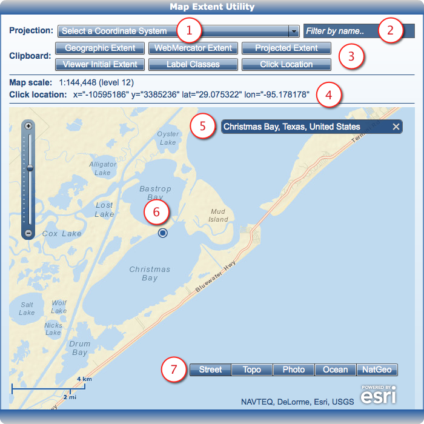

# mapextentutil-desktop-flex

<!-- short description -->
The Map Extent Utility is a handy little Adobe AIR application that can save time capturing map extents in geographic, web mercator, or various Esri spatial reference coordinate ids.

<!-- thumbnail with hyperlink -->
[]()

## Features

1. Select a geographic or projected spatial reference id from the drop down list.
2. Filter the drop down list from #1 by typing in a few letters of your search.
3. Copy various text snippets to the clipboard.
    * Geographic Extent: ```<esri:extent><esri:Extent id="extent33" xmin="-95.265382" ymin="28.987668" xmax="-95.035356" ymax="29.137415"><esri:SpatialReference wkid="4326"/></esri:Extent></esri:extent>``` 
    * WebMercator Extent: ```<esri:extent><esri:WebMercatorExtent id="webMercatorExtent33" minlon="-95.265382" minlat="28.987668" maxlon="-95.035356" maxlat="29.137415"/></esri:extent>```
    * Projected Extent: ```<esri:extent><esri:Extent id="projectedExtent33" xmin="4508948.126630" ymin="2241282.769763" xmax="4584644.276982" ymax="2298820.905807"><esri:SpatialReference wkid="3080"/></esri:Extent></esri:extent>```
        * NAD 1927 Texas Statewide Mapping System
    * Viewer Initial Extent: ```initialextent="-10604893.811585845 3374076.482143000 -10579287.407110346 3393147.520700125"```
    * Label Classes: ``` <esri:LabelClass id="labelClass33" minScale="144448" maxScale="144448" labelExpression="" labelPlacement=""/>```
    * Click Location: ```var mapPoint34:MapPoint = new MapPoint(-10595186.308993641, 3385159.8512443355, new SpatialReference(102100));
var webMercatorMapPoint34:WebMercatorMapPoint = new WebMercatorMapPoint(-95.17817799462887, 29.074721514393847);```
4. Click to select the current click location text: ```x="-10595186" y="3385160" lat="29.074722" lon="-95.178178"```
5. Search for a location using the Geocoder component.
6. Click on the map to copy the "Click Location" (see #3) from the Clipboard buttons or the "Click location" (see #4) just about the map.
7. Switch between various base maps.

## Instructions

[Download the application][2] and start using it immediately (requires [Adobe Integrated Runtime][1]) or take [the source code][3] and modify it to your needs.

## Requirements

* Installation requires [Adobe AIR][1]
* Compiling the source code requires Adobe Flex SDK 4.6.0 and ArcGIS API for Flex.

## Resources
* [ArcGIS Viewer for Flex Resource Center](http://links.esri.com/flexviewer)
* [ArcGIS API for Flex Resource Center](http://links.esri.com/flex)
* [Using Spatial References](http://resources.arcgis.com/en/help/rest/apiref/index.html?usingspatialreferences.html)
* [Flex API License agreement](http://www.esri.com/legal/pdfs/mla_e204_e300/english.pdf)
* [ArcGIS Blog](http://blogs.esri.com/esri/arcgis/tag/flex/)
* [@lheberlie](http://twitter.com/lheberlie)

## Issues
Find a bug or want to request a new feature?  Please let us know by [submitting an issue](../../issues "Submit an Issue").

## Licensing
Copyright 2013 Esri

Licensed under the Apache License, Version 2.0 (the "License");
you may not use this file except in compliance with the License.
You may obtain a copy of the License at

http://www.apache.org/licenses/LICENSE-2.0

Unless required by applicable law or agreed to in writing, software
distributed under the License is distributed on an "AS IS" BASIS,
WITHOUT WARRANTIES OR CONDITIONS OF ANY KIND, either express or implied.
See the License for the specific language governing permissions and
limitations under the License.

A copy of the license is available in the repository's [license.txt](license.txt) file.

[1]: http://get.adobe.com/air/
[2]: https://github.com/lheberlie/mapextentutil-desktop-flex/releases
[3]: https://github.com/lheberlie/mapextentutil-desktop-flex